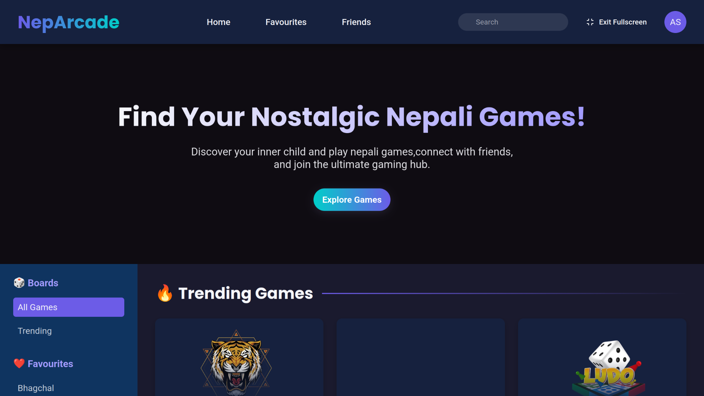
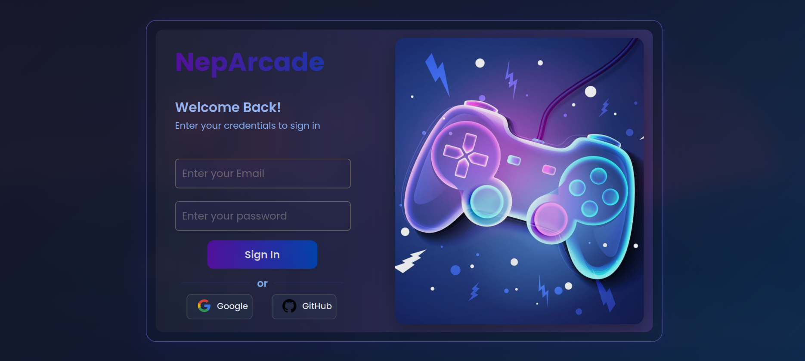

# 🎮 NepArcade


A modern arcade-style game hub built with **Next.js** – fast, fun, and designed for the Nepali gaming community 🇳🇵.

> 🚧 **This project is currently under active development. Stay tuned for more updates!**

---

## 🌐 Live Preview

👉 [Live Preview](https://neparcades.vercel.app/)  

---
## 🖼️ Preview
## HomePage

## LoginPage


---

## 🚀 Features (Planned)

- 🎯 Sleek and responsive UI with Next.js 14
- 🕹️ Launch and host multiple browser-based arcade games
- 📈 Player stats & high score tracking (coming soon)
- 👤 User accounts and leaderboards
- 🌙 Light/Dark theme toggle
- 📱 Mobile-first design
- 🇳🇵 Nepali-inspired UI/UX design

---

## 🛠️ Getting Started

### 🔧 Prerequisites

- Node.js (v18+ recommended)
- npm or yarn

### 📦 Setup

```bash
git clone https://github.com/Anush980/NepArcade-Nxt.git
cd NepArcade-Nxt
npm install
```
#### ▶️ Run in Development

```bash
npm run dev
```
Open localhost to view it in your browser.

## 🧑‍💻 Author

Developed by Anush Shrestha
  - 📍 From Nepal
  -  🎓 BCA Student
  - 💻 Passionate Web & App Developer

## 🤝 Contributing

Want to contribute? Feel free to:

     🐛 Report bugs

     🌟 Suggest features

     📦 Submit pull requests

  - Fork the repo.
  - Make your changes.
  - Submit a PR 🚀
